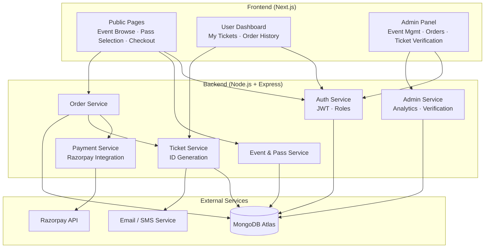
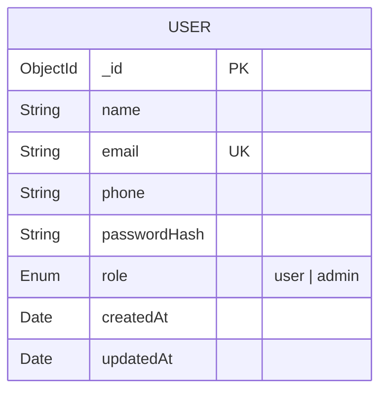
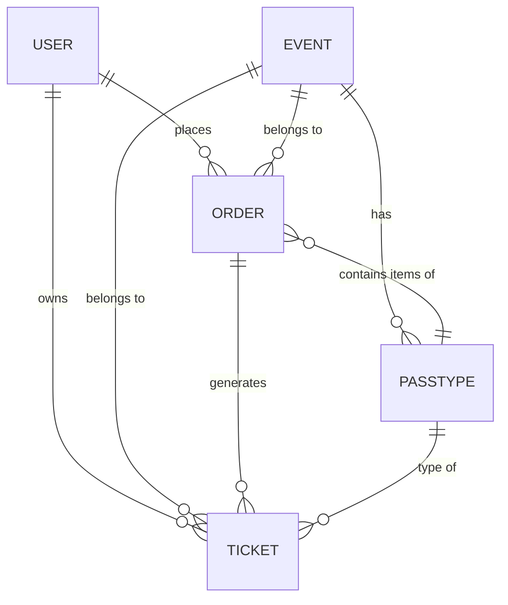
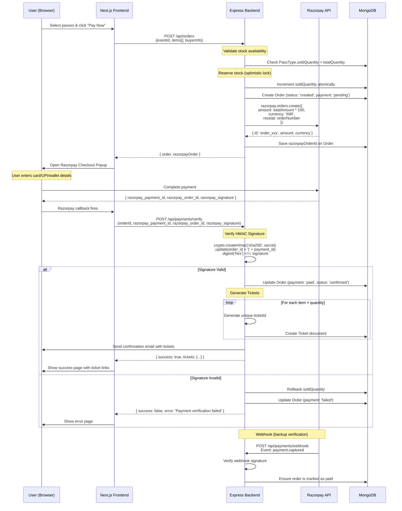
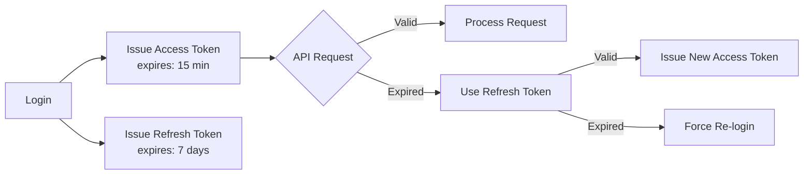
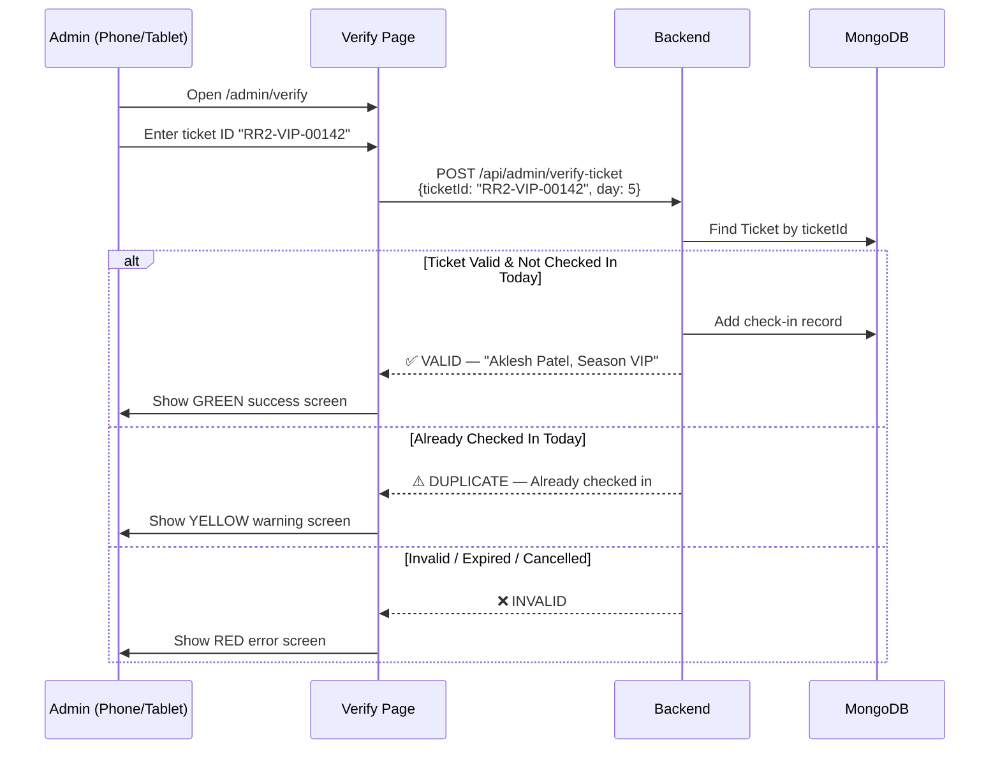
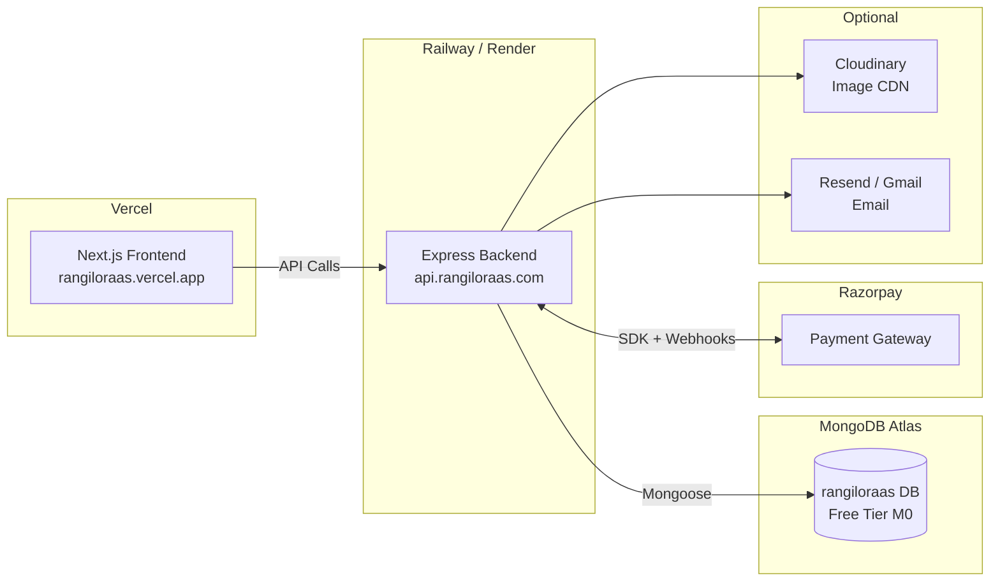

# 🎪 Rangilo Raas 2.0 — System Architecture Design

> **Online Event Pass Selling Platform**
> Season Pass VIP ₹750 · Season Pass GA ₹550 · Day Passes ₹100

---

## 1. High-Level Architecture



---

## 2. Tech Stack

| Layer | Technology | Purpose |
|---|---|---|
| **Frontend** | Next.js 14 (App Router) | SSR, routing, SEO |
| **Styling** | Vanilla CSS + CSS Modules | Premium UI design |
| **Backend** | Node.js 20 + Express 4 | REST API server |
| **Database** | MongoDB Atlas (Mongoose ODM) | Cloud-hosted NoSQL |
| **Auth** | JWT (access + refresh tokens) | Stateless authentication |
| **Payment** | Razorpay Web SDK + Server SDK | Payment processing |
| **Email** | Nodemailer + Gmail / Resend | Ticket delivery |
| **Validation** | Joi / Zod | Request validation |
| **File Storage** | Cloudinary (optional) | Event banners / images |
| **Deployment** | Vercel (frontend) + Railway/Render (backend) | Production hosting |

---

## 3. Project Directory Structure

```
rangiloraas/
├── client/                          # Next.js Frontend
│   ├── app/
│   │   ├── layout.js                # Root layout
│   │   ├── page.js                  # Landing / Home
│   │   ├── events/
│   │   │   ├── page.js              # Event listing
│   │   │   └── [eventId]/
│   │   │       ├── page.js          # Event detail + pass selection
│   │   │       └── checkout/
│   │   │           └── page.js      # Checkout + payment
│   │   ├── auth/
│   │   │   ├── login/page.js
│   │   │   └── register/page.js
│   │   ├── dashboard/
│   │   │   ├── page.js              # User dashboard
│   │   │   └── tickets/
│   │   │       └── [ticketId]/page.js  # Individual ticket view
│   │   └── admin/
│   │       ├── page.js              # Admin overview / analytics
│   │       ├── events/
│   │       │   ├── page.js          # Manage events
│   │       │   └── [eventId]/page.js
│   │       ├── orders/page.js       # View orders
│   │       ├── attendees/page.js    # View attendees
│   │       └── verify/page.js        # Ticket ID verification for check-in
│   ├── components/
│   │   ├── layout/                  # Header, Footer, Sidebar
│   │   ├── ui/                      # Button, Card, Modal, Input
│   │   ├── event/                   # EventCard, PassSelector
│   │   ├── checkout/                # CheckoutForm, PaymentButton
│   │   ├── ticket/                  # TicketCard, TicketDisplay
│   │   └── admin/                   # Charts, DataTable, VerifyForm
│   ├── lib/
│   │   ├── api.js                   # Axios instance + interceptors
│   │   ├── auth.js                  # Auth context / hooks
│   │   └── utils.js                 # Helpers
│   ├── styles/
│   │   ├── globals.css              # Design tokens + base styles
│   │   └── modules/                 # CSS Modules per component
│   └── public/
│       └── assets/                  # Static images, icons
│
├── server/                          # Express Backend
│   ├── src/
│   │   ├── app.js                   # Express app setup
│   │   ├── server.js                # Entry point
│   │   ├── config/
│   │   │   ├── db.js                # MongoDB connection
│   │   │   ├── razorpay.js          # Razorpay instance
│   │   │   └── env.js               # Environment variables
│   │   ├── models/
│   │   │   ├── User.js
│   │   │   ├── Event.js
│   │   │   ├── PassType.js
│   │   │   ├── Order.js
│   │   │   └── Ticket.js
│   │   ├── routes/
│   │   │   ├── auth.routes.js
│   │   │   ├── event.routes.js
│   │   │   ├── order.routes.js
│   │   │   ├── payment.routes.js
│   │   │   ├── ticket.routes.js
│   │   │   └── admin.routes.js
│   │   ├── controllers/
│   │   │   ├── auth.controller.js
│   │   │   ├── event.controller.js
│   │   │   ├── order.controller.js
│   │   │   ├── payment.controller.js
│   │   │   ├── ticket.controller.js
│   │   │   └── admin.controller.js
│   │   ├── middleware/
│   │   │   ├── auth.middleware.js    # JWT verification
│   │   │   ├── role.middleware.js    # Admin/User role check
│   │   │   ├── validate.middleware.js
│   │   │   └── error.middleware.js
│   │   ├── services/
│   │   │   ├── payment.service.js   # Razorpay logic
│   │   │   ├── ticket.service.js    # Ticket ID generation
│   │   │   └── email.service.js     # Email sender
│   │   └── utils/
│   │       └── generateTicketId.js
│   ├── .env
│   └── package.json
│
└── README.md
```

---

## 4. Database Schema (MongoDB)

### 4.1 User



```javascript
// User Schema
{
  name:         { type: String, required: true, trim: true },
  email:        { type: String, required: true, unique: true, lowercase: true },
  phone:        { type: String, required: true },
  passwordHash: { type: String, required: true },
  role:         { type: String, enum: ['user', 'admin'], default: 'user' },
  createdAt:    { type: Date, default: Date.now },
  updatedAt:    { type: Date, default: Date.now }
}
```

### 4.2 Event

```javascript
// Event Schema
{
  title:        { type: String, required: true },            // "Rangilo Raas 2.0"
  slug:         { type: String, unique: true },              // "rangilo-raas-2"
  description:  { type: String },
  venue:        { type: String, required: true },
  city:         { type: String, required: true },
  bannerImage:  { type: String },                            // URL
  startDate:    { type: Date, required: true },              // Day 1
  endDate:      { type: Date, required: true },              // Day 9
  days: [{                                                   // Individual day details
    dayNumber:  { type: Number },                            // 1–9
    date:       { type: Date },
    title:      { type: String },                            // "Day 1 – Navratri Night"
  }],
  status:       { type: String, enum: ['draft','active','completed','cancelled'], default: 'draft' },
  createdBy:    { type: ObjectId, ref: 'User' },             // Admin who created
  createdAt:    { type: Date, default: Date.now },
  updatedAt:    { type: Date, default: Date.now }
}
```

### 4.3 PassType

```javascript
// PassType Schema
{
  event:         { type: ObjectId, ref: 'Event', required: true },
  name:          { type: String, required: true },           // "Season Pass VIP"
  slug:          { type: String },                           // "season-pass-vip"
  category:      { type: String, enum: ['season','daily'] }, // Season or per-day
  applicableDays:[ { type: Number } ],                       // [1,2,...,9] for season; [3] for day 3
  price:         { type: Number, required: true },           // 750, 550, or 100
  currency:      { type: String, default: 'INR' },
  totalQuantity: { type: Number, required: true },           // Max tickets available
  soldQuantity:  { type: Number, default: 0 },               // Tickets sold so far
  perks:         [{ type: String }],                         // ["Front Row", "Complimentary Dinner"]
  isActive:      { type: Boolean, default: true },
  createdAt:     { type: Date, default: Date.now }
}
// Index: { event: 1, slug: 1 } unique
```

**Pre-configured Pass Types for Rangilo Raas 2.0:**

| Pass Name | Category | Days | Price (₹) |
|---|---|---|---|
| Season Pass VIP | season | 1–9 | 750 |
| Season Pass GA | season | 1–9 | 550 |
| Day 1 Pass | daily | 1 | 100 |
| Day 2 Pass | daily | 2 | 100 |
| Day 3 Pass | daily | 3 | 100 |
| Day 4 Pass | daily | 4 | 100 |
| Day 5 Pass | daily | 5 | 100 |
| Day 6 Pass | daily | 6 | 100 |
| Day 7 Pass | daily | 7 | 100 |
| Day 8 Pass | daily | 8 | 100 |
| Day 9 Pass | daily | 9 | 100 |

### 4.4 Order

```javascript
// Order Schema
{
  orderNumber:      { type: String, unique: true },          // "RR2-20261001-A1B2C3"
  user:             { type: ObjectId, ref: 'User', required: true },
  event:            { type: ObjectId, ref: 'Event', required: true },
  items: [{
    passType:       { type: ObjectId, ref: 'PassType' },
    passName:       { type: String },                        // Denormalized for history
    quantity:       { type: Number, required: true },
    unitPrice:      { type: Number, required: true },
    subtotal:       { type: Number, required: true }
  }],
  totalAmount:      { type: Number, required: true },        // Sum of all subtotals
  currency:         { type: String, default: 'INR' },

  // Razorpay fields
  razorpayOrderId:  { type: String },                        // order_xxxxxxxxxxxxx
  razorpayPaymentId:{ type: String },                        // pay_xxxxxxxxxxxxx
  razorpaySignature:{ type: String },

  paymentStatus:    { type: String,
    enum: ['pending','paid','failed','refunded'],
    default: 'pending'
  },
  orderStatus:      { type: String,
    enum: ['created','confirmed','cancelled'],
    default: 'created'
  },

  // Buyer info (captured at checkout, in case guest checkout is added)
  buyerName:        { type: String },
  buyerEmail:       { type: String },
  buyerPhone:       { type: String },

  paidAt:           { type: Date },
  createdAt:        { type: Date, default: Date.now },
  updatedAt:        { type: Date, default: Date.now }
}
// Index: { user: 1 }, { razorpayOrderId: 1 }
```

### 4.5 Ticket

```javascript
// Ticket Schema
{
  ticketId:     { type: String, unique: true },              // "RR2-VIP-00142"
  order:        { type: ObjectId, ref: 'Order', required: true },
  event:        { type: ObjectId, ref: 'Event', required: true },
  passType:     { type: ObjectId, ref: 'PassType', required: true },
  user:         { type: ObjectId, ref: 'User', required: true },

  // Holder info
  holderName:   { type: String, required: true },
  holderEmail:  { type: String, required: true },
  holderPhone:  { type: String },

  // Validity
  validDays:    [{ type: Number }],                          // [1,2,...9] for season; [5] for day 5
  
  // Check-in tracking
  checkIns: [{
    day:        { type: Number },                            // Which day checked in
    checkedInAt:{ type: Date },
    checkedInBy:{ type: ObjectId, ref: 'User' }              // Admin who verified
  }],

  status:       { type: String,
    enum: ['active','used','cancelled','expired'],
    default: 'active'
  },

  createdAt:    { type: Date, default: Date.now }
}
// Index: { ticketId: 1 }, { order: 1 }, { user: 1 }, { event: 1 }
```

### Schema Relationships



---

## 5. API Endpoints

### 5.1 Authentication

| Method | Endpoint | Auth | Description |
|---|---|---|---|
| `POST` | `/api/auth/register` | — | Register new user |
| `POST` | `/api/auth/login` | — | Login, returns JWT tokens |
| `POST` | `/api/auth/refresh` | Refresh Token | Get new access token |
| `GET` | `/api/auth/me` | User | Get current user profile |
| `PUT` | `/api/auth/me` | User | Update profile |
| `POST` | `/api/auth/forgot-password` | — | Send reset email |
| `POST` | `/api/auth/reset-password` | — | Reset with token |

**Request / Response Examples:**

```
POST /api/auth/register
Body: { name, email, phone, password }
Response: { success: true, user: { _id, name, email, role }, tokens: { accessToken, refreshToken } }

POST /api/auth/login
Body: { email, password }
Response: { success: true, user: {...}, tokens: { accessToken, refreshToken } }
```

### 5.2 Events (Public + Admin)

| Method | Endpoint | Auth | Description |
|---|---|---|---|
| `GET` | `/api/events` | — | List active events |
| `GET` | `/api/events/:slug` | — | Get event detail + pass types |
| `POST` | `/api/events` | Admin | Create event |
| `PUT` | `/api/events/:id` | Admin | Update event |
| `DELETE` | `/api/events/:id` | Admin | Delete/archive event |

### 5.3 Pass Types (Admin)

| Method | Endpoint | Auth | Description |
|---|---|---|---|
| `GET` | `/api/events/:eventId/passes` | — | List pass types for event |
| `POST` | `/api/events/:eventId/passes` | Admin | Create pass type |
| `PUT` | `/api/passes/:id` | Admin | Update pass type |
| `DELETE` | `/api/passes/:id` | Admin | Delete pass type |

### 5.4 Orders & Checkout

| Method | Endpoint | Auth | Description |
|---|---|---|---|
| `POST` | `/api/orders` | User | Create order (initiate checkout) |
| `GET` | `/api/orders` | User | List user's orders |
| `GET` | `/api/orders/:id` | User | Get order detail |
| `POST` | `/api/orders/:id/cancel` | User | Cancel order (if unpaid) |

**Create Order Request:**
```json
{
  "eventId": "648a...",
  "items": [
    { "passTypeId": "648b...", "quantity": 2 },
    { "passTypeId": "648c...", "quantity": 1 }
  ],
  "buyerName": "Aklesh Patel",
  "buyerEmail": "aklesh@example.com",
  "buyerPhone": "9876543210"
}
```

**Create Order Response:**
```json
{
  "success": true,
  "order": { "_id": "...", "orderNumber": "RR2-20261001-A1B2C3", "totalAmount": 1650 },
  "razorpayOrder": {
    "id": "order_xxxxxxxxx",
    "amount": 165000,
    "currency": "INR"
  }
}
```

### 5.5 Payments (Razorpay)

| Method | Endpoint | Auth | Description |
|---|---|---|---|
| `POST` | `/api/payments/create-order` | User | Create Razorpay order (called internally by order creation) |
| `POST` | `/api/payments/verify` | User | Verify payment signature after Razorpay checkout |
| `POST` | `/api/payments/webhook` | — | Razorpay webhook (payment.captured, etc.) |

**Verify Payment Request (after Razorpay Checkout popup closes):**
```json
{
  "orderId": "648d...",
  "razorpay_order_id": "order_xxxxxxxxx",
  "razorpay_payment_id": "pay_xxxxxxxxx",
  "razorpay_signature": "sha256_hmac_signature"
}
```

### 5.6 Tickets

| Method | Endpoint | Auth | Description |
|---|---|---|---|
| `GET` | `/api/tickets` | User | List user's tickets |
| `GET` | `/api/tickets/:ticketId` | User | Get ticket detail (unique ID, pass info, validity) |
| `GET` | `/api/tickets/:ticketId/download` | User | Download ticket as PDF/image |

### 5.7 Admin

| Method | Endpoint | Auth | Description |
|---|---|---|---|
| `GET` | `/api/admin/dashboard` | Admin | Revenue, ticket counts, trends |
| `GET` | `/api/admin/orders` | Admin | All orders (with filters/pagination) |
| `GET` | `/api/admin/orders/:id` | Admin | Order detail |
| `GET` | `/api/admin/attendees` | Admin | All ticket holders (with filters) |
| `GET` | `/api/admin/revenue` | Admin | Revenue breakdown by pass type |
| `POST` | `/api/admin/verify-ticket` | Admin | Verify & check-in via ticket ID lookup |
| `GET` | `/api/admin/check-ins` | Admin | Check-in log for a day |

**Verify Ticket Request:**
```json
{
  "ticketId": "RR2-VIP-00142",
  "day": 5
}
```

**Verify Ticket Response:**
```json
{
  "success": true,
  "valid": true,
  "ticket": {
    "ticketId": "RR2-VIP-00142",
    "holderName": "Aklesh Patel",
    "passName": "Season Pass VIP",
    "validDays": [1,2,3,4,5,6,7,8,9],
    "alreadyCheckedInToday": false
  }
}
```

---

## 6. Payment Flow (Razorpay)



### Payment Flow — Key Design Decisions

> [!IMPORTANT]
> **Stock Reservation**: Use MongoDB's `findOneAndUpdate` with `$inc` and a condition check (`soldQuantity + requested <= totalQuantity`) to atomically reserve stock. This prevents overselling under concurrent purchases.

> [!IMPORTANT]
> **Dual Verification**: Always verify payments both via the frontend callback (immediate UX) AND the Razorpay webhook (reliable backend confirmation). The webhook is the source of truth.

> [!WARNING]
> **Never trust the frontend amount**. Always calculate the total on the server side by looking up pass prices from the database.

### Razorpay Configuration Required

```
RAZORPAY_KEY_ID=rzp_live_xxxxxxxxxx
RAZORPAY_KEY_SECRET=xxxxxxxxxxxxxxxxxx
RAZORPAY_WEBHOOK_SECRET=xxxxxxxxxxxxxxxxxx
```

---

## 7. Authentication & Authorization

### JWT Token Strategy



| Token | Storage | Lifetime | Purpose |
|---|---|---|---|
| Access Token | Memory / `Authorization` header | 15 minutes | API authentication |
| Refresh Token | HttpOnly cookie | 7 days | Silent token renewal |

### Role-Based Access Control

| Role | Permissions |
|---|---|
| **Guest** | Browse events, view pass types |
| **User** | Everything Guest can do + purchase passes, view own orders & tickets |
| **Admin** | Everything + create/edit events & passes, view all orders, revenue analytics, ticket ID verification |

### Middleware Chain

```
Public Route:    [rateLimiter] → [controller]
User Route:      [rateLimiter] → [verifyJWT] → [controller]
Admin Route:     [rateLimiter] → [verifyJWT] → [requireAdmin] → [controller]
Webhook Route:   [rawBodyParser] → [verifyWebhookSignature] → [controller]
```

---

## 8. Ticket ID System

### Ticket ID Format

Each ticket receives a **unique, human-readable ID** generated server-side:

```
Format:  RR2-{PASS_CODE}-{SEQUENCE}
Examples:
  RR2-VIP-00142     → Season Pass VIP, ticket #142
  RR2-GA-00089      → Season Pass GA, ticket #89
  RR2-D5-00231      → Day 5 Pass, ticket #231
```

**Generation strategy:**
- Prefix: Event code (`RR2`)
- Pass code: `VIP`, `GA`, `D1`–`D9`
- Sequence: Zero-padded auto-incrementing counter per pass type
- Uniqueness enforced by MongoDB unique index on `ticketId`

### Ticket Verification Flow (Admin — Manual Lookup)



---

## 9. Admin Dashboard — Feature Map

```mermaid
graph TD
    ADMIN["Admin Dashboard"]
    
    ADMIN --> EVENTS["Event Management"]
    EVENTS --> E1["Create / Edit Event"]
    EVENTS --> E2["Manage Pass Types"]
    EVENTS --> E3["Set Prices & Quantities"]
    
    ADMIN --> ANALYTICS["Analytics"]
    ANALYTICS --> A1["Total Revenue"]
    ANALYTICS --> A2["Tickets Sold by Type"]
    ANALYTICS --> A3["Daily Sales Trend"]
    ANALYTICS --> A4["Revenue by Pass Type (Pie Chart)"]
    
    ADMIN --> ORDERS["Order Management"]
    ORDERS --> O1["All Orders List"]
    ORDERS --> O2["Filter by Status / Date"]
    ORDERS --> O3["Order Detail View"]
    ORDERS --> O4["Refund Processing"]
    
    ADMIN --> ATTENDEES["Attendee Management"]
    ATTENDEES --> AT1["All Attendees List"]
    ATTENDEES --> AT2["Filter by Pass Type / Day"]
    ATTENDEES --> AT3["Export to CSV"]
    
    ADMIN --> CHECKIN["Check-in System"]
    CHECKIN --> C1["Ticket ID Verification"]
    CHECKIN --> C2["Today's Check-in Count"]
    CHECKIN --> C3["Check-in Log"]
```



---

## 10. Environment Variables

### Backend (`server/.env`)

```env
# Server
PORT=5000
NODE_ENV=production

# MongoDB
MONGODB_URI=mongodb+srv://<user>:<pass>@cluster.mongodb.net/rangiloraas

# JWT
JWT_ACCESS_SECRET=<random-64-char-string>
JWT_REFRESH_SECRET=<random-64-char-string>
JWT_ACCESS_EXPIRY=15m
JWT_REFRESH_EXPIRY=7d

# Razorpay
RAZORPAY_KEY_ID=rzp_live_xxxxxxxxxx
RAZORPAY_KEY_SECRET=xxxxxxxxxxxxxxxxxx
RAZORPAY_WEBHOOK_SECRET=xxxxxxxxxxxxxxxxxx

# Email (Nodemailer)
SMTP_HOST=smtp.gmail.com
SMTP_PORT=587
SMTP_USER=your-email@gmail.com
SMTP_PASS=app-password

# Frontend URL (for CORS)
CLIENT_URL=https://rangiloraas.vercel.app

# Admin seed
ADMIN_EMAIL=admin@rangiloraas.com
ADMIN_PASSWORD=<secure-password>
```

### Frontend (`client/.env.local`)

```env
NEXT_PUBLIC_API_URL=https://api.rangiloraas.com
NEXT_PUBLIC_RAZORPAY_KEY_ID=rzp_live_xxxxxxxxxx
```

---

## 11. Security Considerations

| Concern | Mitigation |
|---|---|
| **SQL/NoSQL Injection** | Mongoose schemas with strict types + Joi/Zod validation |
| **XSS** | React auto-escapes; Content-Security-Policy headers |
| **CSRF** | SameSite cookies; token-based auth |
| **Rate Limiting** | `express-rate-limit` on auth & payment routes |
| **Overselling** | Atomic MongoDB operations for stock management |
| **Payment Tampering** | Server-side price calculation; HMAC signature verification |
| **Ticket ID Forgery** | Server-side validation against DB; IDs are non-sequential enough to prevent guessing |
| **Brute Force** | Account lockout after N failed attempts |
| **Data Exposure** | Helmet.js for headers; field-level projection in queries |

---

## 12. Deployment Architecture



---

## 13. Key User Journeys

### Journey 1: Buying a Season Pass

1. User lands on homepage → sees **Rangilo Raas 2.0** event card
2. Clicks event → sees event details, dates (Day 1–9), pass options
3. Selects **Season Pass VIP × 2** and **Day 5 Pass × 1** → cart shows ₹1,600
4. Clicks **Proceed to Checkout** → enters name, email, phone
5. Clicks **Pay ₹1,600** → Razorpay popup opens
6. Pays via UPI / Card / Wallet
7. Payment verified → 3 tickets generated with unique IDs (e.g. RR2-VIP-00142)
8. Redirected to **Success Page** → can view/download tickets
9. Email received with ticket PDFs attached

### Journey 2: Admin Check-in at Venue

1. Admin logs in on phone → navigates to `/admin/verify`
2. Selects current day (e.g., "Day 5")
3. Enters attendee's ticket ID (e.g. `RR2-VIP-00142`) shown on their digital ticket
4. **GREEN** → "✅ Aklesh Patel — Season VIP — Welcome!"
5. **YELLOW** → "⚠️ Already checked in today"
6. **RED** → "❌ Invalid ticket" or "❌ Not valid for Day 5"

---

## Next Steps

> [!TIP]
> Review this architecture and confirm the design before we begin implementation. Key decisions to finalize:
> 1. **Guest checkout**: Should users be able to buy without creating an account?
> 2. **Multiple attendees**: Can one order have tickets for different people (names)?
> 3. **Refund policy**: Should admins be able to process refunds through the platform?
> 4. **Email provider**: Gmail (free, rate-limited) or Resend/SendGrid (better for production)?
> 5. **Domain**: Do you have a custom domain, or shall we use default Vercel/Railway URLs?

Once you approve, I will implement the system in phases:
- **Phase 1**: Backend (models, auth, event/pass APIs)
- **Phase 2**: Payment integration (Razorpay full flow)
- **Phase 3**: Ticket generation (unique IDs, email delivery)
- **Phase 4**: Frontend (public pages, checkout, dashboard)
- **Phase 5**: Admin panel (analytics, ticket verification, management)
- **Phase 6**: Polish, testing, deployment
